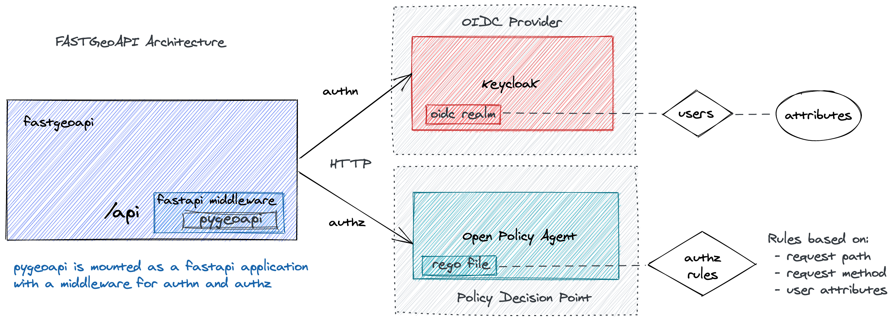

# fastgeoapi

 A modern, high-performance geospatial API framework that extends [pygeoapi](https://github.com/geopython/pygeoapi) with authentication, authorization, and security features using FastAPI, OpenID Connect, and Open Policy Agent (OPA) 🗺️🔒.

<div align="center">
  <a href="https://pygeoapi.io">
    
  </a>
  &nbsp;&nbsp;&nbsp;&nbsp;
  <a href="https://www.openpolicyagent.org">
    
  </a>
</div>

[](https://pypi.org/project/fastgeoapi/)
[](https://pypi.org/project/fastgeoapi/)
[](https://www.python.org)
[](https://github.com/geobeyond/fastgeoapi/blob/main/LICENSE)

[](https://geobeyond.github.io/fastgeoapi/)
[](https://github.com/geobeyond/fastgeoapi/actions?workflow=Tests)
[](https://github.com/geobeyond/fastgeoapi/actions/workflows/contract-tests.yml)
[](https://github.com/geobeyond/fastgeoapi/actions/workflows/zap-scan.yml)
[](https://codecov.io/gh/geobeyond/fastgeoapi)

[](https://github.com/pre-commit/pre-commit)
[](https://github.com/astral-sh/ruff)
[](https://github.com/astral-sh/uv)

## Architecture

This diagram gives an overview of the basic architecture:



## Features

### 🔐 Security & Authentication

- **OpenID Connect (OIDC) Integration** - OAuth2/JWT Bearer token authentication with JWKS support
- **API Key Authentication** - Flexible API key-based authentication for programmatic access
- **Open Policy Agent (OPA)** - Policy-based authorization with fine-grained access control
- **Multi-scheme Support** - Seamlessly switch between authentication methods based on your needs

### 🚀 Performance & Modern Stack

- **FastAPI Framework** - High-performance async API built on Starlette and Pydantic
- **Async I/O** - Non-blocking operations for better scalability
- **Modern Python** - Python 3.12+ with type hints and modern language features
- **Fast Dependency Management** - UV-based tooling for lightning-fast installations

### 🗺️ Geospatial API Standards

- **OGC API Compliance** - Full support for OGC API - Features, Processes, and more
- **OpenAPI Integration** - Auto-generated, security-enhanced OpenAPI specifications
- **Geospatial Data Access** - Seamless access to vector and raster geospatial data
- **pygeoapi Extension** - Extends vanilla pygeoapi with enterprise-ready security

### 🛡️ Security Testing & Quality

- **Contract Testing** - Automated OpenAPI contract validation with Schemathesis
- **Security Scanning** - OWASP ZAP integration for continuous security testing
- **Pre-commit Hooks** - Code quality checks with Ruff formatting and linting
- **Comprehensive Test Coverage** - Full test suite with pytest and coverage reporting

## Requirements

- [pygeoapi](https://github.com/geopython/pygeoapi/)
- [fastapi-opa](https://github.com/busykoala/fastapi-opa)
- An OpenID Connect provider (Keycloak, WSO2, etc)
- Open Policy Agent (OPA)

## Installation

You can install _fastgeoapi_ via [pip](https://pip.pypa.io/) from [PyPI](https://pypi.org/):

```shell
pip install fastgeoapi
```

## Development

### Prerequisites

Install [UV](https://github.com/astral-sh/uv) - a fast Python package installer and resolver:

**macOS / Linux:**

```bash
curl -sSf https://install.ultraviolet.dev | sh
```

**Windows (PowerShell):**

```powershell
powershell -ExecutionPolicy ByPass -c "irm https://astral.sh/uv/install.ps1 | iex"
```

### Setup

After cloning the repository, use UV to install dependencies:

```shell
git clone https://github.com/geobeyond/fastgeoapi.git
cd fastgeoapi
uv sync
```

This automatically:

- Creates a virtual environment in `.venv`
- Installs all required dependencies including git-based packages from `[tool.uv.sources]` (pygeoapi master, pygeofilter, fencer)
- Sets up fastgeoapi in development mode

> **Note:** For development, UV uses git-based dependencies defined in `[tool.uv.sources]` to get the latest features from upstream projects. The PyPI release uses stable published versions. See [uv.md](uv.md) for more details.

### Activate the Virtual Environment

**macOS / Linux:**

```bash
source .venv/bin/activate
```

**Windows (PowerShell):**

```powershell
.venv\Scripts\Activate.ps1
```

### Running fastgeoapi

Once Keycloak and OPA have been started, configure the required environment variables:

```shell
export PYGEOAPI_CONFIG=pygeoapi-config.yml
export PYGEOAPI_OPENAPI=pygeoapi-openapi.yml
export FASTGEOAPI_CONTEXT='/geoapi'
```

Start fastgeoapi in development mode:

```shell
uv run fastapi run app/main.py --app app --host 0.0.0.0 --port 5000 --reload
```

## Quick Start (Package Installation)

Install fastgeoapi:

```shell
pip install fastgeoapi
```

Create a `.env` file with the required configuration:

```shell
# Environment state: 'dev' or 'prod'
ENV_STATE=dev

# Server configuration
HOST=0.0.0.0
PORT=5000

# Logging (required)
DEV_LOG_PATH=/tmp
DEV_LOG_FILENAME=fastgeoapi.log
DEV_LOG_LEVEL=debug
DEV_LOG_ENQUEUE=true
DEV_LOG_ROTATION=1 days
DEV_LOG_RETENTION=1 months

# Pygeoapi configuration
DEV_PYGEOAPI_BASEURL=http://localhost:5000
DEV_PYGEOAPI_CONFIG=pygeoapi-config.yml
DEV_PYGEOAPI_OPENAPI=pygeoapi-openapi.yml
DEV_FASTGEOAPI_CONTEXT=/geoapi

# Authentication (choose one, all others must be false)
DEV_API_KEY_ENABLED=false
DEV_JWKS_ENABLED=false
DEV_OPA_ENABLED=false
```

Start the server:

```shell
fastgeoapi run
```

With options:

```shell
fastgeoapi run --host 0.0.0.0 --port 5000 --reload
```

See the [Getting Started guide](https://geobeyond.github.io/fastgeoapi/getting-started/) for complete setup instructions including authentication options and examples.

### Common UV Commands

```bash
# Update dependencies
uv sync --upgrade

# View installed packages
uv pip list

# Install a new package
uv pip install package-name

# Install dev dependencies
uv pip install --group dev
```

For more details, see [uv.md](uv.md).

## Release Workflow

This project uses a branching strategy with automated releases:

| Branch    | Target   | Description                                |
| --------- | -------- | ------------------------------------------ |
| `develop` | TestPyPI | Development releases with `.dev` suffix    |
| `main`    | PyPI     | Production releases when version is bumped |

### Development Releases

Push to `develop` branch triggers automatic publishing to [TestPyPI](https://test.pypi.org/project/fastgeoapi/):

```bash
git checkout develop
# Make changes
git commit -m "feat: add new feature"
git push origin develop
```

The workflow automatically creates a dev version (e.g., `0.0.4.dev.1733912345`) and publishes to TestPyPI.

### Production Releases

To create a production release on [PyPI](https://pypi.org/project/fastgeoapi/):

1. Update the version in `pyproject.toml`
2. Merge to `main` branch
3. The workflow detects the version change, creates a git tag, and publishes to PyPI

```bash
# Update version in pyproject.toml to e.g., 0.0.4
git checkout main
git merge develop
git push origin main
```

Both workflows use [Trusted Publisher](https://docs.pypi.org/trusted-publishers/) (OIDC) for secure, tokenless authentication with PyPI/TestPyPI.

## Usage

Please see the [Command-line
Reference](https://geobeyond.github.io/fastgeoapi/reference/) for
details.

Please have a look at the `docker-compose.yml` file under `scripts/iam` to start the stack with **Keycloak** and **Open Policy Agent** locally. There is a `README.md` file that explains how to use it.

The file `scripts/iam/keycloak/realm-export.json` can be used to import an already configured realm into Keycloak.

The files under `scripts/postman` can be used to setup Postman with a configuration that is ready to perform the requests for the whole stack.

## Contributing

Contributions are very welcome. To learn more, see the [Contributor
Guide](CONTRIBUTING.rst).

## License

Distributed under the terms of the [MIT
license](https://opensource.org/licenses/MIT), _fastgeoapi_ is free and open-source software.

## Issues

If you encounter any problems, please [file an
issue](https://github.com/geobeyond/fastgeoapi/issues) along with a detailed description.

## Credits

This project was generated from
[\@cjolowicz](https://github.com/cjolowicz)\'s [Hypermodern Python
Cookiecutter](https://github.com/cjolowicz/cookiecutter-hypermodern-python)
template.
