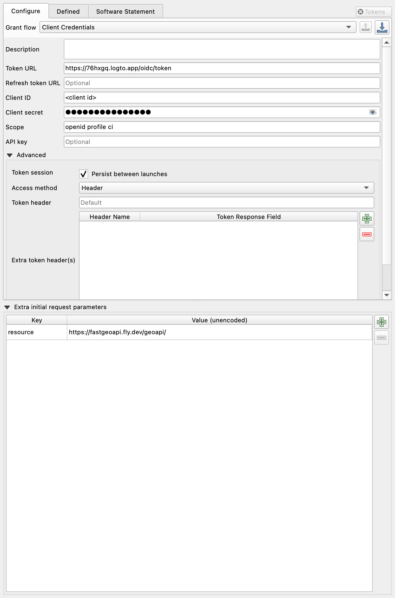
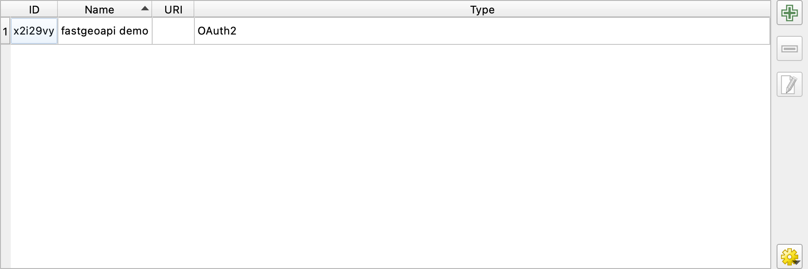
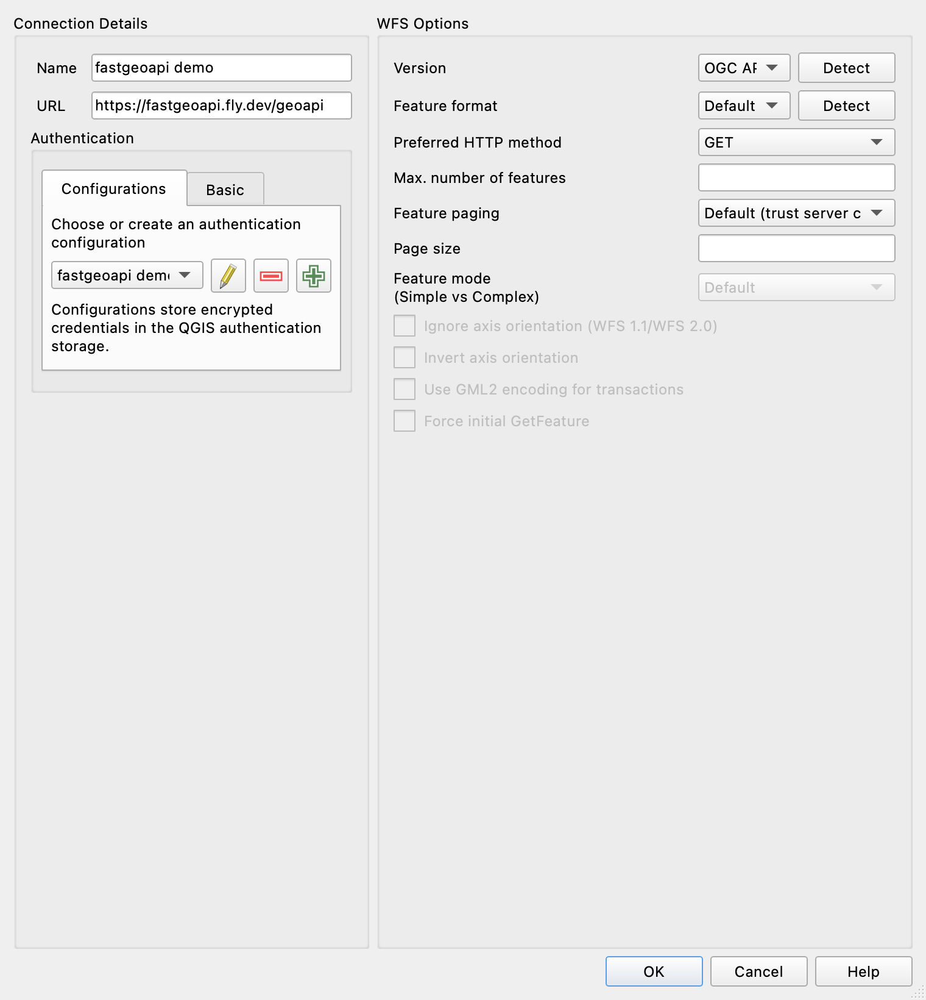
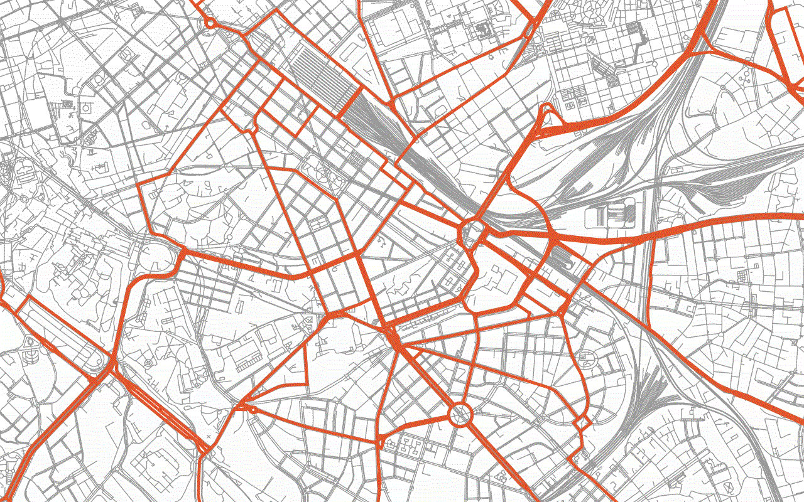

# :material-map-search-outline: Using fastgeoapi from QGIS

Put a protected fastgeoapi on a QGIS map: the same dataset once as
features and once as vector tiles, both behind an OAuth2 token that
QGIS obtains and renews by itself. The walkthrough uses the public demo
and takes about ten minutes.

You need a recent QGIS with the built-in **OAuth2** authentication
method and its _Client Credentials_ grant. The configuration below was
verified with QGIS 4.2: loaded into its authentication store, it
fetched the demo's landing page, a page of features and a vector tile
through QGIS's own network stack, and the same requests without it
were refused with `401`.

## What the demo expects

The demo protects everything under `/geoapi` with a JSON Web Token
issued by its identity provider. A token is accepted when three things
hold: the signature verifies against the provider's keys, the issuer is
`https://76hxgq.logto.app/oidc`, and the audience is
`https://fastgeoapi.fly.dev/geoapi/`. How the token was obtained does
not matter to the server.

For this tutorial the demo publishes a machine client. Its id and secret
are the ones behind the `Authorization: Basic` header in
[Getting started](../../operators/tutorials/getting-started.md), which
is the one place they are published; decode that header to read them.
They are demo credentials, scoped to the demo API, and nothing else
accepts them.

| Setting         | Value                                         |
| --------------- | --------------------------------------------- |
| Token URL       | `https://76hxgq.logto.app/oidc/token`         |
| Grant           | Client Credentials                            |
| Client ID       | from Getting started                          |
| Client secret   | from Getting started                          |
| Scope           | `openid profile ci`                           |
| Extra parameter | `resource=https://fastgeoapi.fly.dev/geoapi/` |

The last line is the one people forget. The audience of a Logto token
comes from the `resource` parameter of the token request
([RFC 8707](https://www.rfc-editor.org/rfc/rfc8707)); without it the
token is perfectly valid and the demo still answers `401`, because the
`aud` claim is missing.

## Step 1: an authentication configuration

QGIS keeps credentials in its own encrypted store and attaches them to
connections by reference, so the token never appears in a project file.

1. Open **Settings ▸ Options ▸ Authentication**. The first time, QGIS
   asks you to set a master password for the store.
2. Click **:material-plus: Add** and fill in:
   - **Name**: `fastgeoapi demo`
   - **Authentication type**: _OAuth2 authentication_
   - **Grant flow**: _Client Credentials_
   - **Token URL**, **Client ID**, **Client Secret** and **Scope** from
     the table above
   - under the query parameters of the request, one pair:
     `resource` = `https://fastgeoapi.fly.dev/geoapi/`
   - tick **Persist between launches**, so the token survives a restart
3. **Save**.



The configuration then appears in the list under **Settings ▸ Options ▸
Authentication**, with the short id QGIS uses to refer to it:



The dialog can also load the same configuration from a file. This is
what it contains, in the format the OAuth2 method reads and writes:

```json
{
  "version": 1,
  "configType": 1,
  "grantFlow": 4,
  "accessMethod": 0,
  "name": "fastgeoapi demo",
  "tokenUrl": "https://76hxgq.logto.app/oidc/token",
  "clientId": "<client id>",
  "clientSecret": "<client secret>",
  "scope": "openid profile ci",
  "queryPairs": { "resource": "https://fastgeoapi.fly.dev/geoapi/" },
  "persistToken": true,
  "requestTimeout": 30
}
```

`grantFlow: 4` is _Client Credentials_ and `accessMethod: 0` sends the
token as an `Authorization: Bearer` header, which is what fastgeoapi
reads.

## Step 2: the features

1. Open **Layer ▸ Data Source Manager ▸ WFS / OGC API - Features** and
   click **New**.
2. **Name**: `fastgeoapi demo`. **URL**: the landing page,
   `https://fastgeoapi.fly.dev/geoapi`. For OGC API - Features the URL is
   the landing page, not a `GetCapabilities`.
3. **Version**: _OGC API - Features_, or click **Detect**.
4. In the **Authentication** section choose the configuration from
   step 1, then **OK**.
5. **Connect**. The collections appear: pick `lazio-roads`, tick
   **Only request features overlapping the view extent**, and **Add**.



Zoom to Rome. QGIS asks the server for the features in view, a page at a
time, and every request carries a token it obtained from Logto on your
behalf. When the token expires, an hour later, QGIS requests a new one
without asking you anything.

The view-extent option is not cosmetic here: `lazio-roads` is 743,000
road segments, and the server caps a page at 50 features. Without it
QGIS would page through the whole collection.

## Step 3: the same roads as vector tiles

1. **Data Source Manager ▸ Vector Tile ▸ New ▸ New Generic Connection**.
2. **Name**: `Lazio roads (tiles)`. **URL**:

   ```text
   https://fastgeoapi.fly.dev/geoapi/collections/lazio-roads-tiles/tiles/WebMercatorQuad/{z}/{y}/{x}?f=pbf
   ```

3. **Min. zoom level** `0`, **Max. zoom level** `13`.
4. **Authentication**: the same configuration. **OK**, then **Add**.

Two details of that URL are pygeoapi's rather than QGIS's. The row
comes before the column, so the template is `{z}/{y}/{x}` and not the
`{z}/{x}/{y}` most servers use. And `f=pbf` is required: without it the
server answers `400`. Both come straight from the tileset's own
metadata, which also tells you the zoom range:

```text
https://fastgeoapi.fly.dev/geoapi/collections/lazio-roads-tiles/tiles/WebMercatorQuad/metadata?f=tilejson
```

QGIS gives the layer a default style; the layer inside the tiles is
called `roads`, and the attributes are `class`, `subclass`, `subtype`
and `name`, if you want to style by road class.

This is the result, rendered by QGIS through the same configuration:
the vector tiles in grey underneath, and on top the main roads from the
features layer in orange, picked by a renderer rule on `class`.



The screenshots on this page are produced by QGIS itself, headless, by
`scripts/qgis_tutorial_screenshots.py` in the repository, from the same
values quoted here.

## What is happening underneath

Every request QGIS makes to the demo carries `Authorization: Bearer`
with a token from Logto. To obtain it, QGIS posts the client id and
secret, the scope and the `resource` parameter to the token URL, and
Logto answers with a JWT valid for an hour whose `aud` is the demo's
API. fastgeoapi verifies the signature against Logto's published keys,
checks issuer and audience, and lets the request through to pygeoapi.
The client-credentials grant has no refresh token, so when the token
expires QGIS simply repeats the request.

This is the same token you would obtain with `curl` in
[Getting started](../../operators/tutorials/getting-started.md); QGIS
just does it for you and keeps the secret in its store.

## Variants

**A deployment behind an API key.** Use the **API Header**
authentication method instead, with one header: `X-API-KEY` and the
key. Everything else in steps 2 and 3 is identical.

**A token you already hold.** The API Header method works for that too,
with `Authorization` as the header and `Bearer <token>` as the value.
It stops working when the token expires, which is why the OAuth2 method
is worth the extra minute.

**Signing in as a person.** The OAuth2 method also offers the
_Authorization Code_ and _PKCE_ grants, which open your browser for a
login and then continue exactly as above; QGIS listens on
`http://127.0.0.1:7070/` for the callback by default. fastgeoapi needs
nothing more for that, since it validates the token and not the flow.
What it takes is an application registered at the identity provider
that allows that redirect URI and access to the API; the demo does not
publish one today.

## A layer filter stays on your machine

QGIS can push a layer filter (**Set Filter**, or a subset string) to an
OGC API - Features server as a CQL2 expression, but only when the
server's conformance declaration lists the Part 3 `filter` classes.
pygeoapi answers CQL2 filters and lists `cql2-text`, yet it does not
declare `ogcapi-features-3/1.0/conf/filter` and `conf/features-filter`,
so QGIS decides the server cannot filter and a **Set Filter** on the
layer produces an empty layer without a single request. Filter on the
client instead: a rule-based renderer with `"class" IN ('primary', 'secondary')` draws the main roads from what the view extent fetched,
and that is how the map above was made.

## When something does not work

| Symptom                                   | Cause and remedy                                                                                            |
| ----------------------------------------- | ----------------------------------------------------------------------------------------------------------- |
| `401` on every request, token obtained    | The `resource` parameter is missing, so the token has no audience. Add the query pair and clear the token.  |
| `401` and no token                        | Client id, secret or token URL wrong. Test the token request with `curl` as in Getting started.             |
| Tiles answer `400`                        | `f=pbf` missing from the URL template.                                                                      |
| Tile layer empty at some zooms            | Outside the archive's zoom range: `lazio-roads-tiles` holds 0–13, `overture-places-tiles` only 14.          |
| First features request takes many seconds | `overture-places` is read across an ocean; `lazio-roads` sits next to the server. See the GeoParquet guide. |
