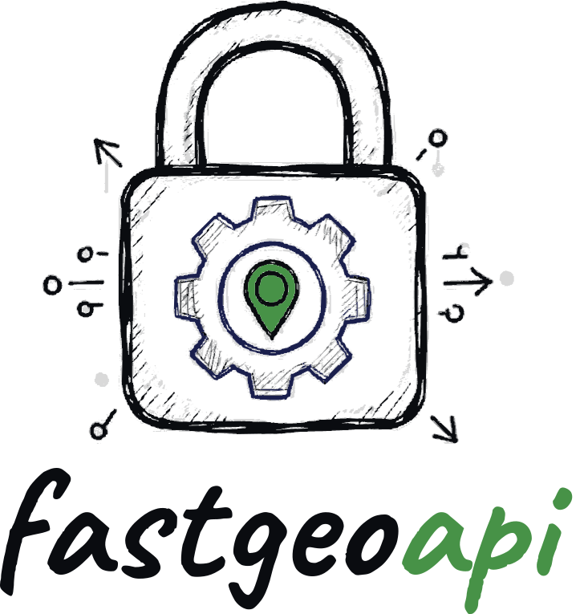

<p align="center">
  
</p>

An OGC API server built on [pygeoapi](https://pygeoapi.io), with the
things a deployment needs around it: authentication, data read straight
from object storage, a configuration you can change without a restart,
and an endpoint AI agents can use.

<div class="grid cards" markdown>

- **Serve standard geospatial APIs**

    OGC API — Features, Processes, Tiles, and more, from pygeoapi
    unchanged. Everything upstream serves, this serves.

    [Why fastgeoapi](operators/explanation/why-fastgeoapi.md)

- **Put it behind authentication**

    OAuth2 with JWKS, an API key, or Open Policy Agent — pygeoapi has no
    authentication of its own, and this is most of what fastgeoapi is
    for.

    [Getting started](operators/tutorials/getting-started.md)

- **Read data where it lives**

    GeoParquet from S3, GCS or Azure, queried in place with DuckDB — no
    copy held by the server, and the configuration itself can live in a
    bucket.

    [GeoParquet provider](operators/how-to/geoparquet.md) ·
    [Config from cloud storage](operators/how-to/cloud-config.md)

- **Let agents use it**

    An MCP endpoint with its own authorization server, so a client like
    Claude can query your collections as tools.

    [MCP server](consumers/index.md)

</div>

## Where to start

If you are **standing a server up**, read
[Getting started](operators/tutorials/getting-started.md) and then the
[configuration reference](operators/reference/configuration.md).

If you are **changing a configuration that already runs**, the
[editor](operators/how-to/configuration-editor.md) will tell you whether it builds before
you save it.

If you are **connecting an agent**, start at
[MCP getting started](consumers/tutorials/connecting-an-mcp-client.md).

## Live demo

A running instance is at
[fastgeoapi.fly.dev](https://fastgeoapi.fly.dev/geoapi), serving both a
local dataset and Overture Maps data read directly from object storage.
Its [OpenAPI document](consumers/reference/openapi.md) is published here.

## Installation

```bash
pip install fastgeoapi
fastgeoapi run
```

The full instructions — including the authentication options, which are
the part worth reading — are in
[Getting started](operators/tutorials/getting-started.md).
