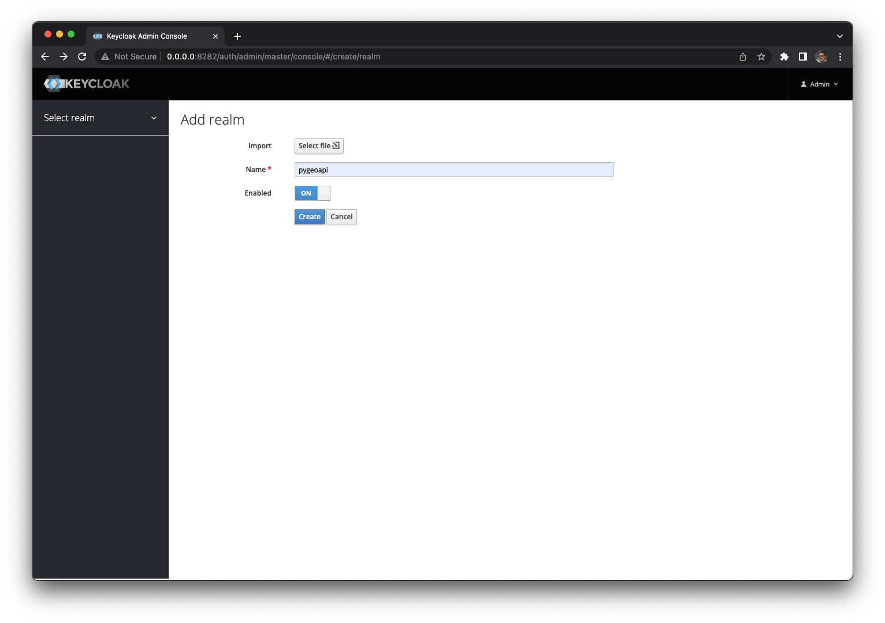
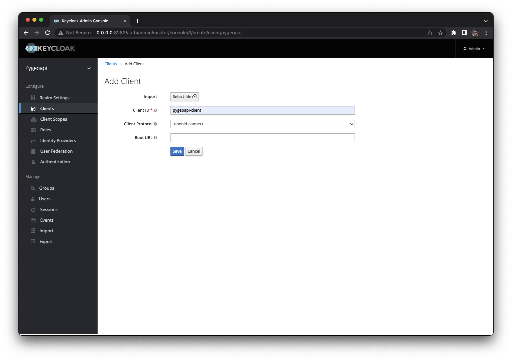
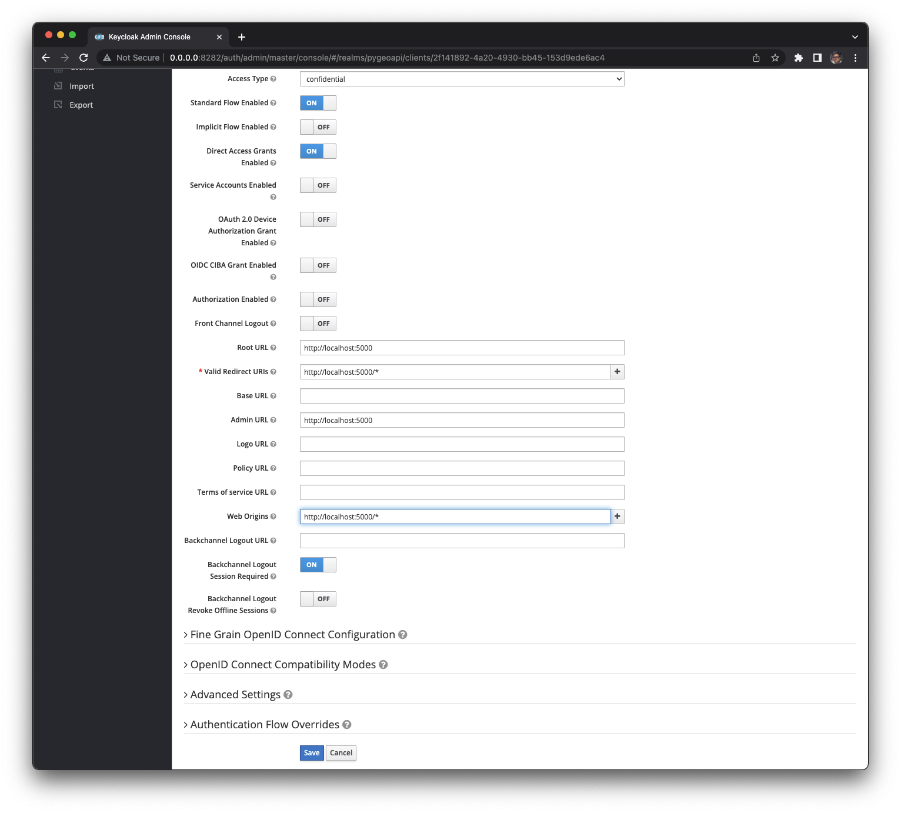
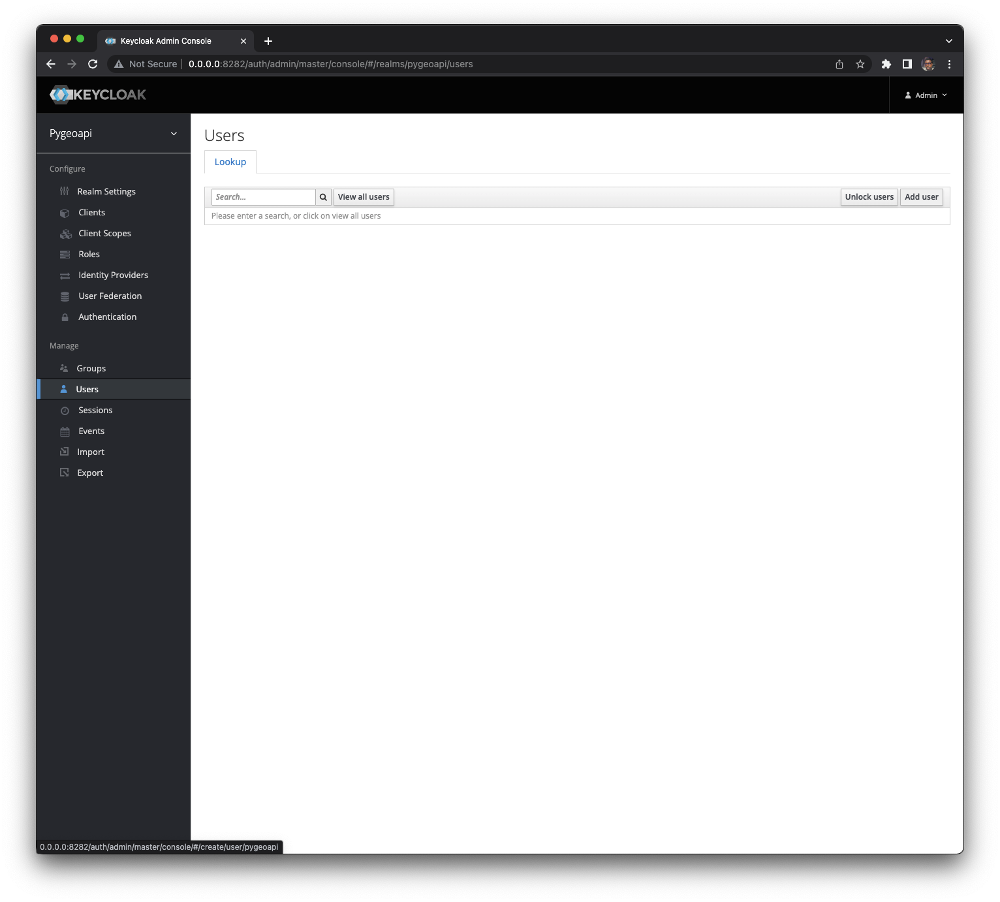
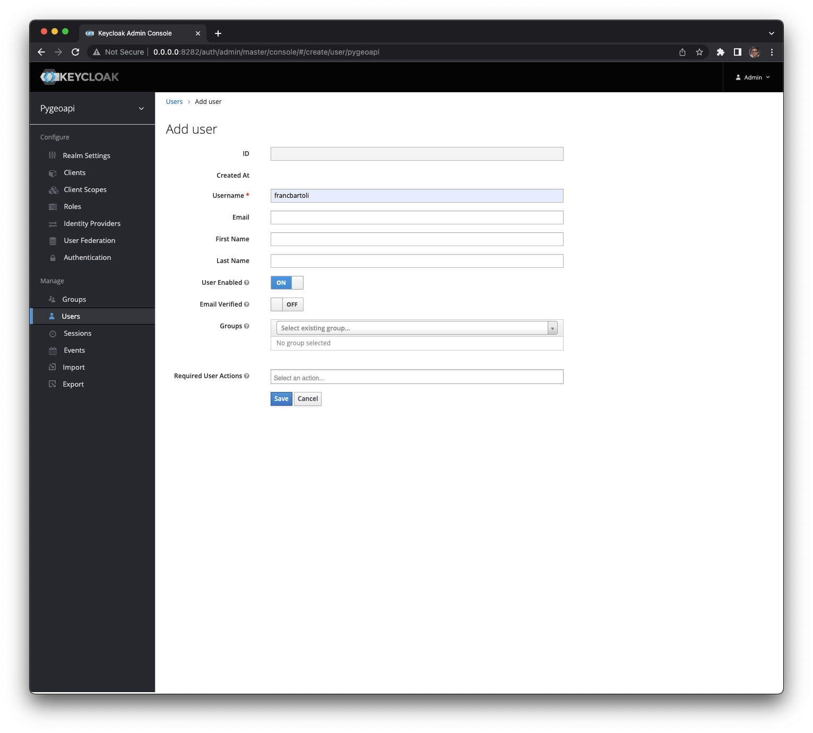
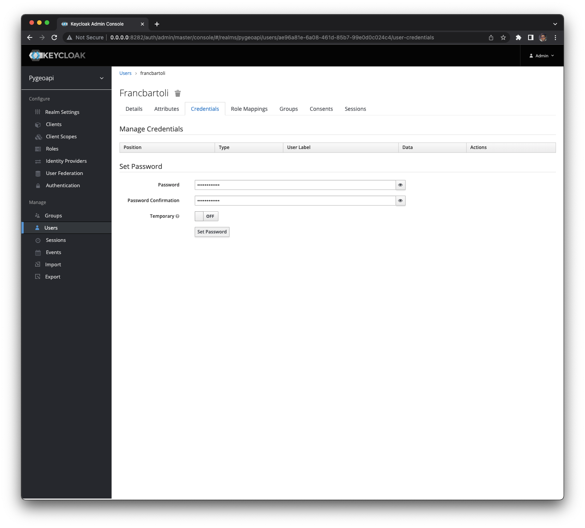
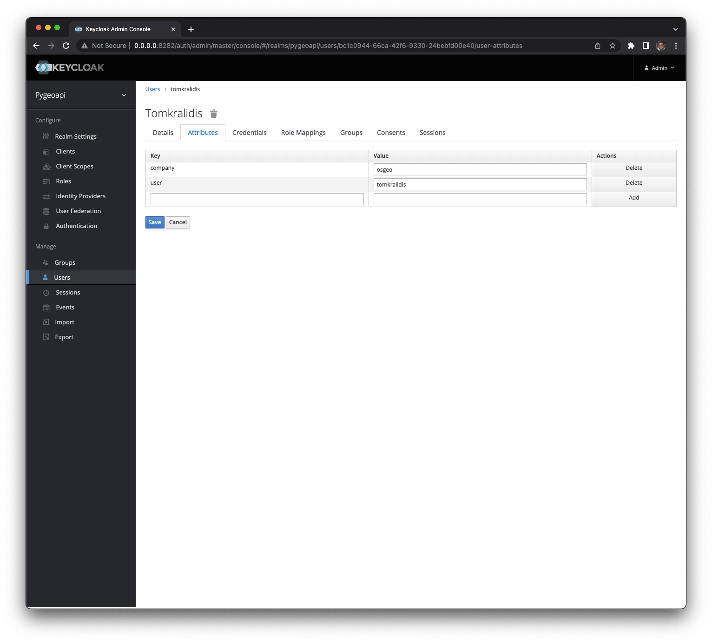
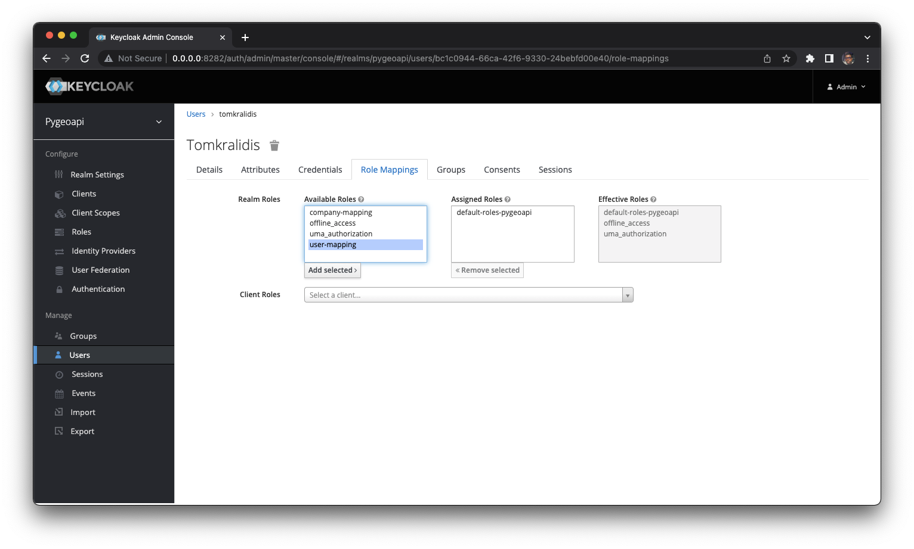

# How to use Keycloak and Open Policy Agent

## Run Keycloak and OPA together

```shell
docker-compose up -d
```

## Configure Keycloak

Open the administration interface at `http://localhost:8282/admin/master/console/` and access with the credentials `admin/admin`.

---
**NOTE**

1. If you are using the provided Docker setup, the Keycloak realm JSON file will be automatically loaded during startup. This file contains the realm configuration, including the realm name and settings. However, if you are using a different Keycloak setup, follow the steps below to manually create/import the realm and 

2. To provide better support for Docker environments, we have made updates to the Keycloak setup. One important change is the inclusion of persistent storage for the database using PostgreSQL. This ensures that any changes made to Keycloak configuration or data will be preserved even after restarting the Docker container.

---

### Create a new realm

- _Add realm_ with the name `pygeoapi` and click on the _Create_ button
  
- In the _Clients_ menu under _Configure_ click on the button _Create_ on the top-right corner to _Add Client_ with a **Client ID** called `pygeoapi-client` and then click _Save_.
  

- In the _settings_ page

  - Set _Access Type_ to `confidential`
  - Set _Root URL_ to `http://localhost:5000`
  - Set _Valid Redirect URIs_ to `http://localhost:5000/*`
  - Set _Admin URL_ to `http://localhost:5000`
  - Set _Web Origins_ to `http://localhost:5000/*`
  - Click the _Save_ button
    

- Set _client_id_ and _client_secret_ in the application configuration

### Create new users

Click on the _Add User_ button the _Users_ page



- Add _Username_ with value `francbartoli`



- Under _Credentials_
  - Set _Password_ to `francbartoli`
  - Set _Temporary_ to `off`



- Under _Attributes_

  - Set key/value
    - `user=francbartoli`
    - `company=geobeyond`



- Add _Username_ with value `tomkralidis`
- Under _Credentials_
  - Set _Password_ to `tomkralidis`
  - Set _Temporary_ to `off`
- Under _Attributes_
  - Set key/value
    - `user=tomkralidis`
    - `company=osgeo`

### Create the mapping

Under the tab _Mappers_ of the new realm set the following mapping:

- Name: user-mapping
- Name: company-mapping



## Update the policy

If there are changes in the `auth.rego` then restart the OPA server

```shell
docker-compose stop opa
docker-compose up -d
```

### Company based authorization policy

Let's imagine our users have some attributes, for example the `company` where they are working. In this case we'd like to use it for authorization purposes. If certain rules are added to the policy file, such as:

- allow users from company `osgeo` to access only the collection `obs`

```rego
allow {
    some collection
    input.request_path[0] == "collections"
    input.request_path[1] == collection
    collection = "obs"
    input.company == "osgeo"
}
```

- allow users from company `geobeyond` to access only the collection `lakes`

```rego
allow {
    some collection
    input.request_path[0] == "collections"
    input.request_path[1] == collection
    collection = "lakes"
    input.company == "geobeyond"
}
```

### Policy example

This is a complete and very simple policy for the above example with protected collections only:

```rego
# policy/auth.rego
package httpapi.authz

# HTTP API request
import input
default allow = false

# Allow anyone to root and static files
allow {
    input.request_path = [""]
    input.request_method == "GET"
}

allow {
    input.request_path[0] == "static"
    input.request_path[1] == "img"
    input.request_method == "GET"
}

allow {
    input.request_path[0] == "static"
    input.request_path[1] == "css"
    input.request_method == "GET"
}

# allow anyone to the collections metadata
allow {
    input.request_path = ["collections"]
    input.request_method == "GET"
}

# allow rules for different collections
allow {
    some collection
    input.request_path[0] == "collections"
    input.request_path[1] == collection
    collection = "obs"
    input.company == "osgeo"
}

allow {
    some collection
    input.request_path[0] == "collections"
    input.request_path[1] == collection
    collection = "lakes"
    input.company == "geobeyond"
}
```

## Get Access Token

```shell
export KC_RESPONSE=$(curl -X POST 'http://localhost:8282/realms/pygeoapi/protocol/openid-connect/token' \
 -H "Content-Type: application/x-www-form-urlencoded" \
 -d "username=francbartoli" \
 -d 'password=pygeoapi' \
 -d 'grant_type=password' \
 -d 'client_id=pygeoapi-client' \
 -d 'client_secret=2yholx8r3mqyUJaOoJiZhcqvQDQwmgyD' \
 -d 'response_type=code id_token token' | jq -r '.')
```

Obtain the different response objects:

```shell
KC_ACCESS_TOKEN=$(echo $KC_RESPONSE| jq -r .access_token)
KC_ID_TOKEN=$(echo $KC_RESPONSE| jq -r .id_token)
KC_REFRESH_TOKEN=$(echo $KC_RESPONSE| jq -r .refresh_token)
```

Verify that the user information is correct:

```shell
curl -X GET 'http://localhost:8282/realms/pygeoapi/protocol/openid-connect/userinfo' -H "Content-Type: application/x-www-form-urlencoded" -H "Authorization: Bearer $KC_ACCESS_TOKEN" | jq .
```

you would get something like this:

```json
{
  "sub": "f18a75db-e2a7-4d43-88b0-7bd9330a5c4d",
  "email_verified": false,
  "company": "geobeyond",
  "preferred_username": "francbartoli",
  "user": "francbartoli"
}
```

## Get pygeoapi collections

Get all collections:

```shell
curl -X GET 'http://localhost:5000/api/collections' \
-H "Content-Type: application/x-www-form-urlencoded" \
-H "Authorization: Bearer $KC_ACCESS_TOKEN" | jq .
```

Get the `lakes` collection:

```shell
curl -X GET 'http://localhost:5000/api/collections/lakes' \
-H "Content-Type: application/x-www-form-urlencoded" \
-H "Authorization: Bearer $KC_ACCESS_TOKEN" | jq .
```

you would get the following content:

```json
{
  "id": "lakes",
  "title": "Large Lakes",
  "description": "lakes of the world, public domain",
  "keywords": ["lakes", "water bodies"],
  "links": [
    {
      "type": "text/html",
      "rel": "canonical",
      "title": "information",
      "href": "http://www.naturalearthdata.com/",
      "hreflang": "en-US"
    },
    {
      "type": "application/json",
      "rel": "self",
      "title": "This document as JSON",
      "href": "http://localhost:5000/api/collections/lakes?f=json"
    },
    {
      "type": "application/ld+json",
      "rel": "alternate",
      "title": "This document as RDF (JSON-LD)",
      "href": "http://localhost:5000/api/collections/lakes?f=jsonld"
    },
    {
      "type": "text/html",
      "rel": "alternate",
      "title": "This document as HTML",
      "href": "http://localhost:5000/api/collections/lakes?f=html"
    },
    {
      "type": "application/json",
      "rel": "queryables",
      "title": "Queryables for this collection as JSON",
      "href": "http://localhost:5000/api/collections/lakes/queryables?f=json"
    },
    {
      "type": "text/html",
      "rel": "queryables",
      "title": "Queryables for this collection as HTML",
      "href": "http://localhost:5000/api/collections/lakes/queryables?f=html"
    },
    {
      "type": "application/geo+json",
      "rel": "items",
      "title": "items as GeoJSON",
      "href": "http://localhost:5000/api/collections/lakes/items?f=json"
    },
    {
      "type": "application/ld+json",
      "rel": "items",
      "title": "items as RDF (GeoJSON-LD)",
      "href": "http://localhost:5000/api/collections/lakes/items?f=jsonld"
    },
    {
      "type": "text/html",
      "rel": "items",
      "title": "Items as HTML",
      "href": "http://localhost:5000/api/collections/lakes/items?f=html"
    }
  ],
  "extent": {
    "spatial": {
      "bbox": [[-180, -90, 180, 90]],
      "crs": "http://www.opengis.net/def/crs/OGC/1.3/CRS84"
    },
    "temporal": {
      "interval": [["2011-11-11T11:11:11+00:00", null]]
    }
  },
  "itemType": "feature"
}
```

while getting the `obs` collection:

```shell
curl -X GET 'http://localhost:5000/api/collections/obs' \
-H "Content-Type: application/x-www-form-urlencoded" \
-H "Authorization: Bearer $KC_ACCESS_TOKEN" | jq .
```

the result is a deny since the user works for the company `geobeyond` and the collection `obs` is only accessible to the `osgeo` company:

```json
{
  "message": "Unauthorized"
}
```
