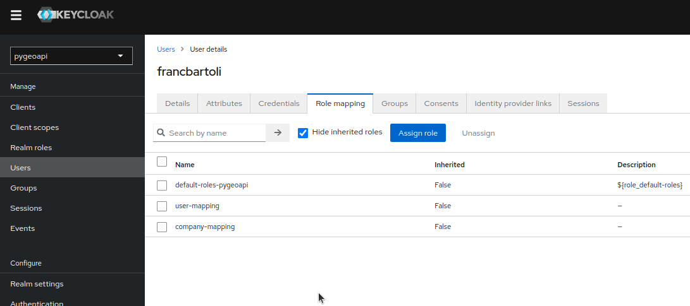

# How to use Keycloak and Open Policy Agent

## Run Keycloak and OPA together

From the root go to the folder `scripts/iam`:

```shell
docker compose up -d
```

Alternatively, you can run separately Keycloak with the following command:

```shell
docker[podman] run --rm --name keycloak -p 8282:8080 \
  -e KEYCLOAK_ADMIN=admin -e KEYCLOAK_ADMIN_PASSWORD=admin \
  quay.io/keycloak/keycloak:latest \
  start-dev
```

and Open Policy Agent with the Rego file for authorization rules:

```shell
docker[podman] run --rm --name opa -p 8383:8181 \
  -v ./policy:/policy \
  openpolicyagent/opa:latest \
  run --server --log-level debug /policy/auth.rego
```

## Configure Keycloak

Open the administration interface at `http://localhost:8282` and access with the credentials `admin/admin`.

### Create a new realm

- _Add realm_ with the name `pygeoapi` and click on the _Create_ button
  
- In the _Clients_ menu under _Manage_ click on the button _Create_ on the _Clients list_ tab, then click the _Create client_ button and fill **Client ID** with `pygeoapi-client`. Then click _Next_.
  
  

- Click on the item just created and in the _settings_ tab

  - Set _Client authentication_ to `On`
  - Set _Root URL_ to `http://localhost:5000`
  - Set _Valid Redirect URIs_ to `http://localhost:5000/*`
  - Set _Admin URL_ to `http://localhost:5000`
  - Set _Web Origins_ to `http://localhost:5000/*`
  - Click the _Save_ button
    

- Set _client_id_ and _client_secret_ in the configuration of the _Credentials_ tab.

### Create new users

Click on the _Users_ menu in the list of the left panel


- Click the _Create new user_ button and fill the _Username_ with the value `francbartoli` then click _Create_


- Click on the tab _Credentials_
  - Set _Password_ to `francbartoli`
  - Set _Temporary_ to `off`


- Click on the tab _Attributes_

  - Set key/value
    - `user=francbartoli`
    - `company=geobeyond`


- Add _Username_ with value `tomkralidis`
- On the tab _Credentials_
  - Set _Password_ to `tomkralidis`
  - Set _Temporary_ to `off`
- On the tab _Attributes_
  - Set key/value
    - `user=tomkralidis`
    - `company=osgeo`

### Create the mapping roles

Under the tab _Realm roles_ of the new realm set the following roles:

- Name: user-role
- Name: company-role


Click on the button _Create role_ and fill in the _Role name_ field and the attributes that are designed to be used in the new realm (i.e. `user`, `company`, etc).

When the role is saved, it's necessary to associate it with both user _francbartoli_ and _tomkralidis_ in Users section.

For each user, in the tab Role Mapping of User Details:

- Click on the button _Assign role_
- Assign roles _user-role_ and _company-role_



## Update the policy

If there are changes in the `auth.rego` then restart the OPA server

```shell
docker-compose stop opa
docker-compose up -d
```

### Company-based authorization policy

Let's imagine our users have some attributes, for example, the `company` where they are working. In this case, we'd like to use it for authorization purposes. If certain rules are added to the policy file, such as:

- allow users from company `osgeo` to access only the collection `obs`

```rego
allow {
    some collection
    input.request_path[0] == "collections"
    input.request_path[1] == collection
    collection = "obs"
    input.company == "osgeo"
}
```

- allow users from company `geobeyond` to access only the collection `lakes`

```rego
allow {
    some collection
    input.request_path[0] == "collections"
    input.request_path[1] == collection
    collection = "lakes"
    input.company == "geobeyond"
}
```

### Policy example

This is a complete and very simple policy for the above example with protected collections only:

```rego
# policy/auth.rego
package httpapi.authz

# HTTP API request
import input
default allow = false

# Allow anyone to root and static files
allow {
    input.request_path = [""]
    input.request_method == "GET"
}

allow {
    input.request_path[0] == "static"
    input.request_path[1] == "img"
    input.request_method == "GET"
}

allow {
    input.request_path[0] == "static"
    input.request_path[1] == "css"
    input.request_method == "GET"
}

# allow anyone to the collections metadata
allow {
    input.request_path = ["collections"]
    input.request_method == "GET"
}

# allow rules for different collections
allow {
    some collection
    input.request_path[0] == "collections"
    input.request_path[1] == collection
    collection = "obs"
    input.company == "osgeo"
}

allow {
    some collection
    input.request_path[0] == "collections"
    input.request_path[1] == collection
    collection = "lakes"
    input.company == "geobeyond"
}
```

## Get Access Token

Get the `client secret` from Keycloack, in Clients -> Client details go to Credetials Tab and show / copy the value:


To set environment variables do the following, replacing `client_id` with the `client secret`:

```shell
export KC_RESPONSE=$(curl -X POST 'http://localhost:8282/realms/pygeoapi/protocol/openid-connect/token' \
 -H "Content-Type: application/x-www-form-urlencoded" \
 -d "username=francbartoli" \
 -d 'password=francbartoli' \
 -d 'grant_type=password' \
 -d 'client_id=pygeoapi-client' \
 -d 'client_secret=RE7P8vMkdk5ZsITzGufzyBbN0PiEmzII' \
 -d 'response_type=code id_token token company' \
 -d 'scope=openid profile email' | jq -r '.')
```

Then obtain the different response objects:

```shell
KC_ACCESS_TOKEN=$(echo $KC_RESPONSE| jq -r .access_token)
KC_ID_TOKEN=$(echo $KC_RESPONSE| jq -r .id_token)
KC_REFRESH_TOKEN=$(echo $KC_RESPONSE| jq -r .refresh_token)
```

Verify that the user information is correct:

```shell
curl -X GET 'http://localhost:8282/realms/pygeoapi/protocol/openid-connect/userinfo' -H "Content-Type: application/x-www-form-urlencoded" -H "Authorization: Bearer $KC_ACCESS_TOKEN" | jq .
```

you would get something like this:

```json
{
  "sub": "1469109e-ac3a-475d-abbf-5ff34ee1502e",
  "email_verified": false,
  "company": "geobeyond",
  "preferred_username": "francbartoli",
  "given_name": "",
  "user": "francbartoli",
  "family_name": ""
}
```

## Get pygeoapi collections

Get all collections:

```shell
curl -X GET 'http://localhost:5000/api/collections' \
-H "Content-Type: application/x-www-form-urlencoded" \
-H "Authorization: Bearer $KC_ACCESS_TOKEN" | jq .
```

Get the `lakes` collection:

```shell
curl -X GET 'http://localhost:5000/api/collections/lakes' \
-H "Content-Type: application/x-www-form-urlencoded" \
-H "Authorization: Bearer $KC_ACCESS_TOKEN" | jq .
```

you would get the following content:

```json
{
  "id": "lakes",
  "title": "Large Lakes",
  "description": "lakes of the world, public domain",
  "keywords": ["lakes", "water bodies"],
  "links": [
    {
      "type": "text/html",
      "rel": "canonical",
      "title": "information",
      "href": "http://www.naturalearthdata.com/",
      "hreflang": "en-US"
    },
    {
      "type": "application/json",
      "rel": "self",
      "title": "This document as JSON",
      "href": "http://localhost:5000/api/collections/lakes?f=json"
    },
    {
      "type": "application/ld+json",
      "rel": "alternate",
      "title": "This document as RDF (JSON-LD)",
      "href": "http://localhost:5000/api/collections/lakes?f=jsonld"
    },
    {
      "type": "text/html",
      "rel": "alternate",
      "title": "This document as HTML",
      "href": "http://localhost:5000/api/collections/lakes?f=html"
    },
    {
      "type": "application/json",
      "rel": "queryables",
      "title": "Queryables for this collection as JSON",
      "href": "http://localhost:5000/api/collections/lakes/queryables?f=json"
    },
    {
      "type": "text/html",
      "rel": "queryables",
      "title": "Queryables for this collection as HTML",
      "href": "http://localhost:5000/api/collections/lakes/queryables?f=html"
    },
    {
      "type": "application/geo+json",
      "rel": "items",
      "title": "items as GeoJSON",
      "href": "http://localhost:5000/api/collections/lakes/items?f=json"
    },
    {
      "type": "application/ld+json",
      "rel": "items",
      "title": "items as RDF (GeoJSON-LD)",
      "href": "http://localhost:5000/api/collections/lakes/items?f=jsonld"
    },
    {
      "type": "text/html",
      "rel": "items",
      "title": "Items as HTML",
      "href": "http://localhost:5000/api/collections/lakes/items?f=html"
    }
  ],
  "extent": {
    "spatial": {
      "bbox": [[-180, -90, 180, 90]],
      "crs": "http://www.opengis.net/def/crs/OGC/1.3/CRS84"
    },
    "temporal": {
      "interval": [["2011-11-11T11:11:11+00:00", null]]
    }
  },
  "itemType": "feature"
}
```

while getting the `obs` collection:

```shell
curl -X GET 'http://localhost:5000/api/collections/obs' \
-H "Content-Type: application/x-www-form-urlencoded" \
-H "Authorization: Bearer $KC_ACCESS_TOKEN" | jq .
```

the result is a deny since the user works for the company `geobeyond` and the collection `obs` is only accessible to the `osgeo` company:

```json
{
  "message": "Unauthorized"
}
```
